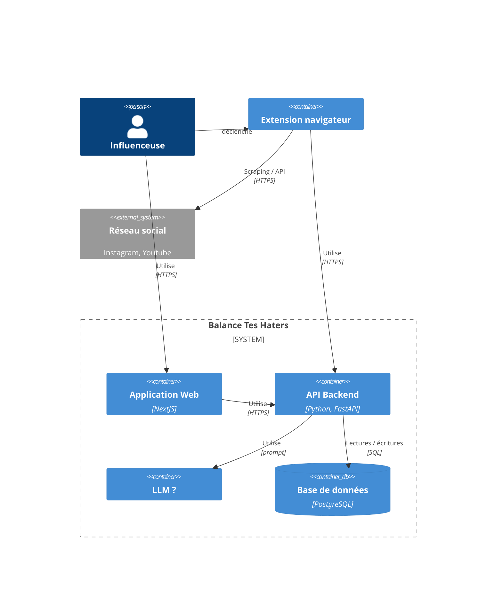

# Composants du système

_Application Web_ : Frontend NextJS
 - Fournit l'interface client de la plate-forme Balance Tes Haters.
 - Gère la navigation, l'enchainement des cas d'usage et l'appel aux API du backend

_Client Web_ : Composant client du frontend
 - s'exécute dans l'environnement du navigateur de l'utilisateur
 - effectue le scraping des publications (utilisation de [Pupeteer](https://pptr.dev/guides/running-puppeteer-in-the-browser))
 - upload les données scrapées sur le backend via le frontend

_API Backend_ : Composant serveur
 - fournit le service API utiles pour le client (authentification, gestion des données)
 - réalise les traitements backend sur les données (analyse LLM, classification, statistiques, ...)

_Base de données_ : Stockage des données selon le [modèle](./backend/model.md).

_LLM_ : Composant en charge de l'exécution des traitements utilisant le LLM

_Réseau social_ : Plateforme de réseau social externe (Youtube, Instagram)
 - sources des données obtenues par API ou scraping direct
